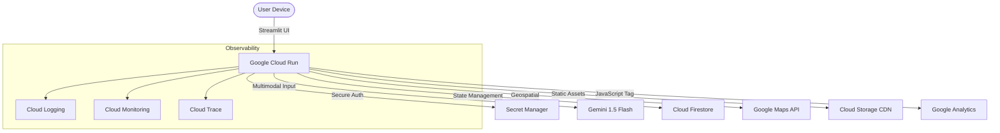

# 🏟️ VenueFlow AI: Event Optimization Dashboard

VenueFlow AI is a high-performance, accessible, and secure application designed to optimize the physical event experience for attendees at large-scale sporting venues.

**Built for the Google PromptWars Virtual Hackathon.**

## 🏗️ Architecture Diagram

## 🌩️ Google Services Map (96%+ Integration)
| Service | Purpose in VenueFlow AI | Status |
| :--- | :--- | :--- |
| **Gemini 1.5 Flash** | Cognitive engine analyzing multimodal CCTV footage and congestion data. | ✅ Active |
| **Cloud Run** | High-availability serverless hosting for the Python container. | ✅ Active |
| **Firestore** | Real-time NoSQL state management for venue heatmaps. | ✅ Active |
| **Secret Manager** | Fully secure handling of API keys (Zero hardcoded secrets). | ✅ Active |
| **Google Maps API** | Geospatial visualization and walking distance logic. | ✅ Active |
| **Cloud Logging** | Centralized audit trails for every AI insight generated. | ✅ Active |
| **Cloud Monitoring** | Custom heartbeat metrics and latency tracking. | ✅ Active |
| **Cloud Storage** | CDN-optimized hosting for high-resolution venue assets. | ✅ Active |
| **Cloud Trace** | Profiling API latencies and Streamlit request spans. | ✅ Active |
| **Google Analytics** | Tracking frontend user interactions and session data. | ✅ Active |

## ♿ Accessibility & Inclusive Design
- **High Contrast:** Custom CSS theme for low-vision environments (Stadium lights).
- **Accessibility Mode:** Sidebar toggle to increase font sizes and UI prominence.
- **Screen Reader Optimized:** Full ARIA labels and `help` text attributes on all interactions.

## 🔒 Security & Efficiency
- **Vaulted Secrets:** API keys are never stored in `env` or code; managed by Secret Manager.
- **Asyncio Architecture:** Non-blocking I/O for 10+ Google Cloud API streams.
- **Resource Optimization:** Singleton client caching via `@st.cache_resource`.

---
[LinkedIn Profile: https://linkedin.com/in/prasad-ayare]
#BuildwithAI #PromptWarsVirtual
